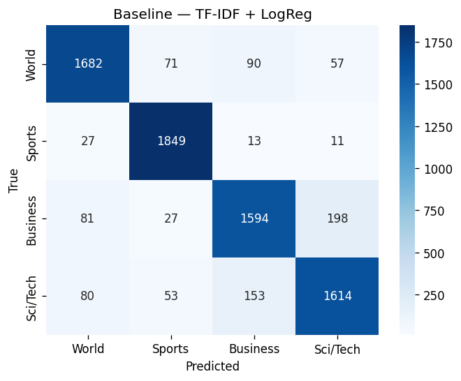
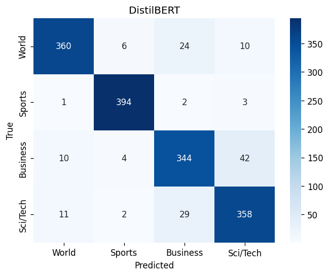

# AG News Topic Classifier

Fine-tuned DistilBERT for 4-class news topic classification, benchmarked against a TF-IDF baseline and served through a FastAPI endpoint in Docker.

## Problem

Classify short news articles into one of four topics: **World**, **Sports**, **Business**, **Sci/Tech**.

The question this project actually answers is not "can a transformer do this" — it's whether the transformer earns its cost over a classical baseline that trains in one second.

## Dataset

[AG News](https://huggingface.co/datasets/fancyzhx/ag_news) via Hugging Face.

- 8,000 balanced training rows sampled (2,000 per class) for tractable training time
- Split 80/20 into train (6,400) and validation (1,600), stratified
- The official 7,600-row test set was held out and evaluated **once**, at the end

## Approach

**Baseline** — TF-IDF (20k features, 1–2 grams, English stop words) + Logistic Regression, wrapped in an sklearn `Pipeline` so the vectorizer is fitted on training data only and cannot leak into validation.

**Transformer** — `distilbert-base-uncased` fine-tuned for 2 epochs at `lr=2e-5` with a linear decay schedule, on Apple MPS.

`max_length=96` was chosen from the token-length distribution of the training set (median 50, p95 78, p99 123). This trades roughly 5% truncation for ~25% faster training versus 128.

## Results

| Model | Test Accuracy | Macro F1 | Train time | Artifact size |
|---|---|---|---|---|
| TF-IDF + Logistic Regression | 0.887 | 0.886 | ~1 s | ~2 MB |
| DistilBERT (fine-tuned) | **0.910** | **0.910** | ~5 min (MPS) | ~260 MB |

Per-class F1 for DistilBERT: Sports 0.97, World 0.91, Sci/Tech 0.89, Business 0.87.

Validation and test scores matched (0.915 / 0.910 accuracy), so the model is not overfitting the sampled subset.

### Confusion matrices

| Baseline | DistilBERT |
|---|---|
|  |  |

Both models share the same dominant failure: Business ↔ Sci/Tech confusion. DistilBERT shifts the direction of the error rather than eliminating it — Sci/Tech recall rises to 0.92 while Business recall falls to 0.84.

## Error analysis

689 of 7,600 test predictions were wrong. Twenty were reviewed by hand and categorised.

The majority are not model failures. AG News applies two labelling conventions that override topic:

1. **Geographic framing wins.** Stories with international or place-heavy framing are labelled *World* regardless of subject. Olympic race results and daily stock-market summaries both appear as World, and the model correctly calls them Sports and Business.

2. **Technology adjacency wins.** Any story touching engineering, software or science is swept into *Sci/Tech* regardless of what the story is about. A Caterpillar acquisition, a bank's VoIP rollout, and an oil-company lawsuit are all labelled Sci/Tech; the model calls them Business.

In most of these cases the model's prediction is arguably more correct than the ground-truth label. The remaining errors are genuine ambiguity — a technology company doing an ordinary business thing, where no clean class boundary exists.

This is visible on unseen input:

```
"Apple reported record quarterly earnings driven by iPhone sales"
→ Sci/Tech 0.83, Business 0.15
```

An earnings report classified as Sci/Tech because the subject is Apple. The model inherited the dataset's bias toward company identity over story subject.

**Implication:** the practical ceiling on this dataset sits well below 100%, and much of the residual gap between the two models is unreachable by either.

## Was the transformer worth it?

+2.4 macro F1 points, for roughly 300× the training time and a 260 MB artifact instead of 2 MB.

On this task, no — for most purposes the baseline is the better engineering choice. Topic classification on news headlines is close to a keyword-matching problem, and TF-IDF was already near the label-noise ceiling.

The transformer becomes worth it when meaning depends on context rather than vocabulary (sarcasm, negation, intent), when training data is scarce enough that pretrained knowledge matters, or when two points of F1 have real downstream value. None of those apply here.

Running the baseline first is what makes that statement possible. Without it, 0.910 looks like a good result rather than a marginal one.

## Setup

```bash
git clone https://github.com/JaswanthJavangula/agnews-topic-classifier.git
cd agnews-topic-classifier

python -m venv venv && source venv/bin/activate
pip install -r requirements-dev.txt

jupyter notebook notebooks/01_baseline_vs_transformer.ipynb
```

The fine-tuned model is not committed (260 MB, above GitHub's file limit). Run the notebook end to end to regenerate it into `models/distilbert/` — about 8 minutes on Apple MPS.

## API

```bash
uvicorn src.app:app --port 8000
```

Interactive docs: `http://localhost:8000/docs`

**Health check**

```bash
curl http://localhost:8000/health
```
```json
{"status":"ok","model":"distilbert-base-uncased-finetuned-ag-news"}
```

**Prediction**

```bash
curl -X POST http://localhost:8000/predict \
  -H "Content-Type: application/json" \
  -d '{"text":"Real Madrid won the Champions League final"}'
```
```json
{
  "label": "Sports",
  "confidence": 0.939,
  "scores": {"World": 0.037, "Sports": 0.939, "Business": 0.0131, "Sci/Tech": 0.0108}
}
```

Empty or oversized input is rejected by Pydantic with a 422 before reaching the model.

## Docker

```bash
docker build -t agnews-classifier .
docker run -p 8000:8000 agnews-classifier
```

Then open `http://localhost:8000/docs`. Predictions are identical to the local run.

## Project structure

```
.
├── notebooks/
│   └── 01_baseline_vs_transformer.ipynb   # data, baseline, fine-tuning, evaluation
├── src/
│   ├── predict.py                         # predict_text(), model loaded once at import
│   └── app.py                             # FastAPI: /health, /predict
├── models/                                # saved artifacts (gitignored)
├── reports/
│   ├── baseline_cm.png
│   ├── distilbert_cm.png
│   └── wrong_predictions.csv
├── Dockerfile
├── requirements.txt                       # serving only
└── requirements-dev.txt                   # notebook + training
```

## Limitations and future work

- Trained on 8k of 120k available rows; more data would likely add a point or two
- `max_length=96` truncates roughly 5% of articles
- Label noise (see error analysis) caps achievable accuracy — a cleaner or re-annotated dataset would be a better test of the transformer
- Container inference is CPU-only with no batching; the image is ~9 GB, reducible to ~3 GB with an ARM-native build and serving-only requirements
- No confidence thresholding — a production system would likely route low-confidence Business/Sci-Tech predictions for review

## Stack

Python 3.12 · PyTorch 2.2 · Hugging Face Transformers 4.44 · scikit-learn · FastAPI · Docker
